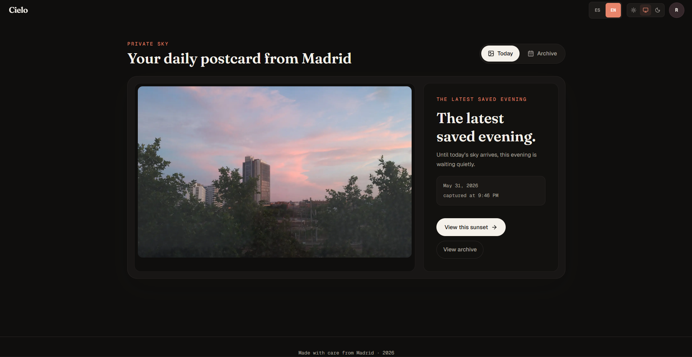
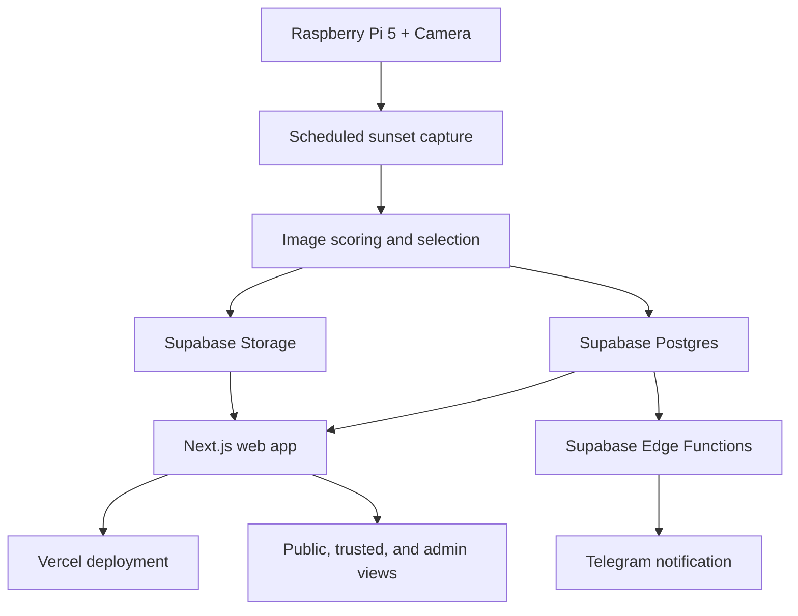

# Madrid Sunsets

[](https://github.com/RAvila-bioeng/madrid-sunsets/actions/workflows/ci.yml)

An end-to-end Raspberry Pi sunset capture platform that automatically photographs Madrid sunsets and publishes selected images through a role-based web gallery.

**Live site:** https://atardeceresmadrid.com/



_Landing page for the public Madrid Sunsets gallery._

Originally built as a personal project, Madrid Sunsets combines embedded capture automation, image-processing heuristics, cloud storage, authentication, notifications, and a deployed web interface into a small privacy-aware product.

## Overview

The system runs a Python service on a Raspberry Pi 5 with a camera, calculates the daily sunset window for Madrid, captures a sequence of JPEGs, scores them with deterministic heuristics, stores the raw and selected images in Supabase, and displays the chosen image in a Next.js web app.

This repository is intentionally small. It is built for reliability, low operating cost, and a polished experience rather than broad multi-user scale.

## Why I Built This

Madrid Sunsets started as a personal gift: a quiet way to save and share the sky from one window, one evening at a time. From an engineering perspective, it is a compact full-stack project that touches hardware, scheduling, image processing, database design, storage policies, server-rendered UI, auth, deployment, and notifications.

## Features

- Raspberry Pi capture service with sunset-aware scheduling.
- Deterministic photo scoring using warmth, saturation, contrast, and sharpness.
- Supabase Storage split between private raw photos and public best-of-day photos.
- Supabase Postgres schema for days, photos, notifications, and live-request records.
- Row Level Security policies for public best-photo access and authenticated archive access.
- Next.js App Router web app with TypeScript and bilingual ES/EN copy.
- Magic-link and OTP authentication through Supabase Auth.
- Environment-based access control for admins and allowed recipients.
- Admin-only server route to mark a different photo as best of day.
- Telegram notification Edge Function and raw-photo purge Edge Function.
- GitHub Actions CI for the JavaScript/TypeScript and Python workspaces.

## Architecture



The Pi is responsible for capture and upload. Supabase stores metadata and image objects. The web app renders the daily public view and protects the archive/admin workflows. Edge Functions handle notification and maintenance jobs.

## Tech Stack

- **Hardware:** Raspberry Pi 5, Raspberry Pi camera.
- **Pi service:** Python 3.11+, APScheduler, Astral, Pillow, OpenCV, supabase-py.
- **Web:** Next.js App Router, React, TypeScript, Tailwind CSS, Framer Motion, next-intl.
- **Backend:** Supabase Postgres, Storage, Auth, Row Level Security, Edge Functions.
- **Deployment:** Vercel for the web app, systemd for the Pi service.
- **Tooling:** pnpm, Turborepo, Biome, ruff, black, mypy, pytest, Vitest.

## Access Model

- **Public visitors:** can see selected best-of-day images and public day metadata.
- **Trusted recipients:** can sign in by email and browse the private archive/day detail views.
- **Admins:** configured through `ADMIN_EMAIL`; can use server-side admin actions such as marking the best photo.

Access control is configured through environment variables, not hardcoded personal emails. The service-role key is only used on the server, the Pi service, and Supabase Edge Functions.

## Repository Structure

```text
apps/
  pi/       Python capture, scoring, upload, and scheduling service
  web/      Next.js web app
packages/
  shared/   Shared generated TypeScript database types
supabase/
  functions/    Edge Functions
  migrations/   Database schema and RLS policies
  templates/    Supabase Auth email templates
docs/
  architecture.md
  deployment.md
  hardware.md
```

## Local Development

Install JavaScript dependencies:

```bash
pnpm install
```

Run the web app:

```bash
pnpm --filter web dev
```

Run the web test suite:

```bash
pnpm --filter web test
```

Run Pi tests from `apps/pi`:

```bash
uv sync
uv run pytest
```

## Environment Variables

Copy `.env.example` to the appropriate local or deployment environment and fill in real values there. Do not commit real `.env` files.

Important variables:

- `NEXT_PUBLIC_SUPABASE_URL`
- `NEXT_PUBLIC_SUPABASE_ANON_KEY`
- `SUPABASE_SERVICE_ROLE_KEY`
- `ADMIN_EMAIL`
- `RECIPIENT_EMAILS`
- `TELEGRAM_BOT_TOKEN`
- `TELEGRAM_CHAT_ID`
- `RESEND_API_KEY`
- `PI_LIVE_URL`
- `PI_SHARED_SECRET`

Only `NEXT_PUBLIC_*` values should be available to browser code. Service-role and notification secrets must stay server-side.

## Deployment

- The web app is designed for Vercel.
- Supabase migrations define the database schema, storage buckets, and RLS policies.
- Edge Functions are deployed from `supabase/functions`.
- The Pi service is intended to run under systemd using `apps/pi/systemd/sunset-pi.service` as a template.

## Raspberry Pi Capture Workflow

1. At solar noon, APScheduler creates the daily capture job.
2. Astral calculates sunset for the configured Madrid coordinates.
3. The Pi captures photos across the configured sunset window.
4. Each JPEG is scored with deterministic image heuristics.
5. Raw photos are uploaded to the private bucket.
6. The chosen best photo is uploaded to the public best bucket.
7. Database rows are updated and the notification Edge Function is called.

## Security And Privacy Notes

- Real secrets belong only in local `.env` files, Vercel/Supabase settings, or the Pi runtime environment.
- Raw photos are private by default and intended to be purged after the configured retention window.
- Public visitors only receive selected best-of-day assets.
- The repository should not contain private photo archives or GPS-bearing image files.
- Admin behavior is checked server-side before using the Supabase service-role client.

## Current Limitations

- The repository currently includes the web live-view route, but not a Pi FastAPI live-view endpoint.
- Access levels are environment-configured and intentionally simple.
- The scoring algorithm is heuristic-based, not ML-based.
- The project is optimized for a tiny audience, not large-scale public traffic.

## Future Improvements

- Add the Pi live-view endpoint and connect the web live request button.
- Add safe demo screenshots for the README.
- Expand Edge Function tests with mocked Supabase clients.
- Add a clean public demo dataset that contains no private image metadata.

## License / Usage Notice

This is a portfolio project and personal system. Reuse the ideas freely, but do not reuse private deployment settings, personal photos, or recipient-specific configuration.
