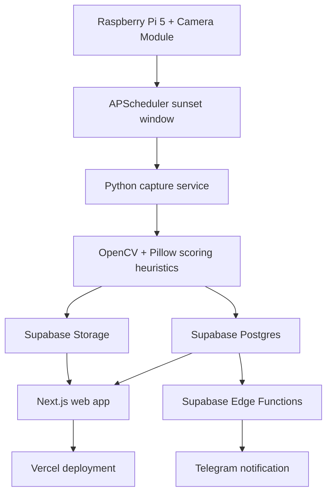

# Architecture

Madrid Sunsets is a small end-to-end system built around one daily workflow: capture the sunset, score the candidates, keep the best image, and publish it through a private web experience.

## Components

- `apps/pi`: Python service for calculating Madrid sunset time, capturing JPEGs, scoring images, uploading to Supabase, and triggering the notification function.
- `supabase`: Postgres schema, storage bucket policies, seed data, email templates, and Edge Functions for notification and raw-image purging.
- `apps/web`: Next.js App Router application with bilingual ES/EN UI, Supabase magic-link auth, public best-photo views, authenticated archive/day views, and an admin mark-best action.
- `packages/shared`: Generated TypeScript database types shared by the web app.

## Access Boundaries

The `sunsets-best` storage bucket is public and contains the selected best-of-day images. The `sunsets-raw` bucket is private. Public visitors can read day rows and best-photo rows through RLS. Authenticated users can access the archive and day-detail views. Admin-only mutation is enforced server-side through the `ADMIN_EMAIL` environment variable before the service-role client is used.

## Known Gap

The web app includes a live-view route, but the repository does not currently include a Pi live-view FastAPI endpoint. Treat live capture-on-demand as future work unless that service is added.
